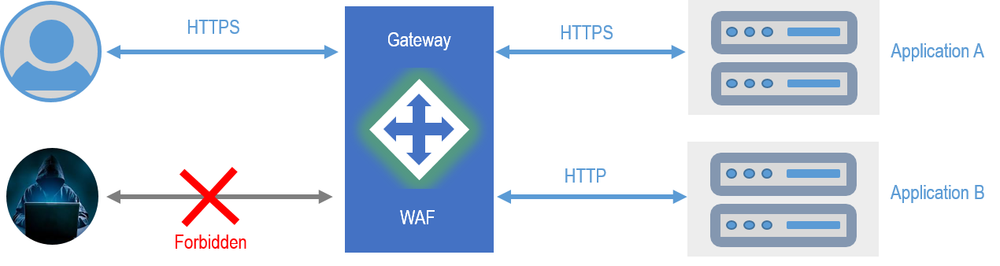
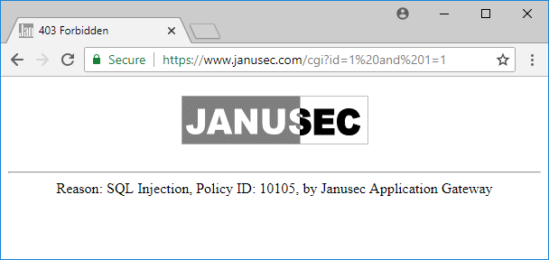
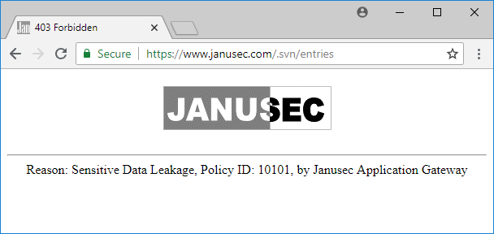

# [Janusec Application Gateway / Janusec应用网关](https://www.janusec.com/) &nbsp; 

## Provide Fast and Secure Application Delivery   
## 提供快速、安全的应用交付   
  

### Key Features (主要特性)  

* Fast Delivery (快速): Web-based Configuration (Web化配置)  

* Security (安全)  

  + Secure Access (安全接入): Enable HTTPS by One Click (一键启用HTTPS)   

  + Secure Authentication (安全认证):  
      - OAuth2: WxWork(企业微信), DingTalk(钉钉), Feishu(飞书)  
      - LDAP + Authenticator 2FA (LDAP+认证码双因子)  

  + Secure Defense (安全防御)  
      - WAF (Web Application Firewall), Block SQL Injection, XSS, Sensitive Data leakage etc. (拦截SQL注入/XSS/敏感数据泄露等)    
      - Block CC Attacks (拦截CC攻击)  
      - CAPTCHA (验证码)  

  + Secure Operation (安全运维): Web SSH Operation (Web界面执行SSH运维)   
 
  + Secure Storage (安全存储): Encryption of Private Key (加密证书私钥)  

* Scalable (可扩展)    
  + Multiple Nodes Load Balance (多节点负载均衡)  
  + Static Content Cache and Acceleration (静态文件缓存加速)  

## Screenshots (截图)   

### SQL Injection Screenshot (SQL注入截图)  

  

### Sensitive Data Leakage Screenshot (敏感信息泄露截图)  

  

## Product Web Site (产品网站)   

English:   
https://janusec.github.io/  
https://doc.janusec.com/  

中文:   
https://doc.janusec.com/cn/  
https://janusec.github.io/cn/  

## Requirements (需求)   

* PostgreSQL 9.3, 9.4, 9.5, 9.6 or 10+ (Required by Development and Primary Node of Deployment, 开发环境，及生产环境主节点需要)  
* CentOS/RHEL 7/8+, Debian 9/10+, CentOS 8 is preferred    
* systemd  
* nftables  
* Golang 1.14+ (Required by Development Only, 仅开发环境需要)  

## Quick Start for Deployment (部署快速指引)    

Detailed documentation is available at： [Janusec Application Gateway Quick Start](https://janusec.github.io/documentation/quick-start/).  

详细文档可在这里获取： [Janusec应用网关快速入门](https://janusec.github.io/cn/quick-start/).

## Quick Start for Developer (开发快速指引)   

> git clone https://github.com/Janusec/janusec.git   

Edit `config.json` (编辑`config.json`)  

> "host": "127.0.0.1",  
> "port": "5432",  
> "user": "janusec",  
> "password": "123456",  
> "dbname": "janusec"  

Janusec will encrypt the password automatically (Janusec将自动加密数据库口令)  
Then (然后):  

> go build  
> su (switch to root)  
> ./janusec  

## Web Administration (Web管理入口) 

When listen=false in config.json (当config.json中listen=false时 ，使用如下地址):  

> http://`your_primary_node_ip_address`/janusec-admin/    (first use / 首次使用)  
> https://`your_application_domain_name`/janusec-admin/   (after certificate configured / 配置证书后)  

When listen=true in config.json （当config.json中listen=true时，使用如下地址):  

> http://`your_primary_node_ip_address:9080`/janusec-admin/    (first use / 首次使用)  
> https://`your_primary_node_domain_name:9443`/janusec-admin/  (after certificate configured / 配置证书和应用后)  

When using primary node only, any application domain name can be used for admin. / 只使用主节点时，任意应用域名均可用于访问管理入口 
But if you have one or more replica nodes, you should apply for a seperate domain name for primary node. / 如果使用了副本节点，应为主节点申请一个单独的域名。   

[Janusec Application Gateway Configuration](https://janusec.github.io/documentation/quick-start/) / [Janusec应用网关配置](https://janusec.github.io/cn/quick-start/)   

## Release (发布) 

Only support Linux Now / 目前仅支持Linux  

> go build  
> su  
> `./release.sh`    

The release package is under `./dist` (生成的发布包位于`./dist`目录).  

## Web Administration Release (Web管理发布)

Release directory is `./static/janusec-admin/` , and source code is available at [Janusec-Admin Github](https://github.com/Janusec/janusec-admin) with Angular 9.   
Web化管理所需的文件在 `./static/janusec-admin/` 目录, 源码在 [Janusec-Admin Github](https://github.com/Janusec/janusec-admin) ，前端源码使用Angular 9.  

## LICENSE (许可证)  

Janusec Application Gateway source files are made available under the terms of the GNU Affero General Public License ([GNU AGPLv3](http://www.gnu.org/licenses/agpl-3.0.html)). / Janusec应用网关源文件使用GNU [AGPLv3](http://www.gnu.org/licenses/agpl-3.0.html)授权.    

## Support (支持)  

* Product: [https://janusec.github.io/](https://janusec.github.io/)  
* 产品网站 [https://janusec.github.io/cn/](https://janusec.github.io/cn/)   
* Official site / 官方网站: [https://www.janusec.com/](https://www.janusec.com/)  
* Email: `support#janusec.com`  
* QQ Group / QQ群: 776900157  , @[U2](https://github.com/zhyale) (The Author)  

* 作者微信公众号： 数据安全架构与治理（Data-Security）  

  
